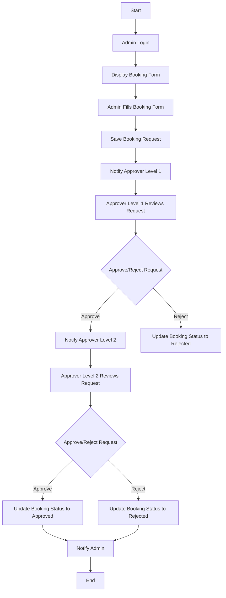

<p align="center"><a href="https://laravel.com" target="_blank"></a></p>
#CarBook

## Physical Data Model
## Physical Data Model

```mermaid
erDiagram
    USERS {
        int id PK
        string name
        string email unique
        string password
        enum role ['admin', 'approver']
        timestamps
    }
    
    VEHICLES {
        int id PK
        string name
        string type
        boolean is_company_owned
        float fuel_consumption
        date last_service_date nullable
        timestamps
    }
    
    BOOKINGS {
        int id PK
        int vehicle_id FK
        string requested_by
        int approver_level_1 FK nullable
        string status_level_1 default 'pending'
        int approver_level_2 FK nullable
        string status_level_2 default 'pending'
        date start_date
        date end_date
        text reason
        timestamps
    }
    
    LOGS {
        int id PK
        int user_id FK
        string action
        timestamps
    }
    
    BOOKING_HISTORIES {
        int id PK
        int vehicle_id FK
        int booking_id FK
        int duration
        timestamps
    }
    
    USERS ||--o{ BOOKINGS : "creates"
    USERS ||--o{ LOGS : "performs"
    USERS ||--o{ BOOKINGS : "approves"
    VEHICLES ||--o{ BOOKINGS : "is booked"
    BOOKINGS ||--o{ BOOKING_HISTORIES : "has"
```


## Activity Diagram for Vehicle Booking


## System Requirements
- PHP Version: 8.2.12
- Database: pgsql 
- Framework: Laravel 11.36.1

## Access Credentials


### Development Environment
```txt
URL: http://localhost:8000
```

| Role    | Username          | Password    |
|---------|------------------|-------------|
| admin   | admin@example.com | password   |
| approver   | approver@example.com  | password   |
| approver   | approver2@example.com  | password   |

### Database Configuration
using supabase 
```txt
DB_CONNECTION=pgsql
DB_HOST=ursupabasehost
DB_PORT=0000
DB_DATABASE=postgres
DB_USERNAME=postgres.usernamecode 
DB_PASSWORD=dbpassword
```

## Installation Guide

1. **Clone Repository**
```bash
git clone https://github.com/Etherlyvan/CarBook.git
```

2. **Install Dependencies**
```bash
composer install
npm install
```

3. **Environment Setup**
```bash
cp .env.example .env
php artisan key:generate
```

4. **Database Setup**
```bash
php artisan migrate
php artisan db:seed
```

5. **Start Development Server**
```bash
php artisan serve
npm run dev
```

## Application Features

### Admin Panel
1. Dashboard
   - View statistics
   - Monitor activities
   - Generate reports

2. Booking Management
   - Create/Delete Booking
   - Assign Approver


3. History
   - See Recent Approval 

### Approver Panel
1. Booking Approve
   - Booking Approval
   - Booking Rejection

## API Documentation

### Authentication
```txt
Endpoint: /api/login
Method: POST
Headers: Accept: application/json
```

Example request:
```json
{
    "email": "user@email.com",
    "password": "password123"
}
```

## Troubleshooting

### Common Issues
1. **Installation Error**
   ```bash
   composer install --ignore-platform-reqs
   ```

2. **Database Connection Error**
   - Check database credentials
   - Ensure database service is running

3. **Permission Issues**
   ```bash
   chmod -R 775 storage bootstrap/cache
   ```

## Deployment Guide

1. **Production Server Setup**
```bash
composer install --optimize-autoloader --no-dev
php artisan config:cache
php artisan route:cache
php artisan view:cache
```

2. **Environment Configuration**
   - Update .env for production
   - Set APP_ENV=production
   - Set APP_DEBUG=false

## Updates and Maintenance

### Version History
- v1.0.0 (2024-01-01)
  - Initial release
  - Basic features implemented

- v1.1.0 (2024-02-01)
  - Added new features
  - Bug fixes

### Backup Procedure
1. Database Backup
```bash
php artisan backup:run
```

2. File Backup
```bash
# Backup storage directory
tar -czf backup.tar.gz storage/
```

## Support Contact

- Technical Support: support@email.com
- Emergency Contact: +62 123 4567 890
- Working Hours: Monday-Friday (9:00-17:00 WIB)

## License
This application is licensed under the [MIT License](LICENSE).
<p align="center">
<a href="https://github.com/laravel/framework/actions"></a>
<a href="https://packagist.org/packages/laravel/framework"></a>
<a href="https://packagist.org/packages/laravel/framework"></a>
<a href="https://packagist.org/packages/laravel/framework"></a>
</p>

## About Laravel

Laravel is a web application framework with expressive, elegant syntax. We believe development must be an enjoyable and creative experience to be truly fulfilling. Laravel takes the pain out of development by easing common tasks used in many web projects, such as:

- [Simple, fast routing engine](https://laravel.com/docs/routing).
- [Powerful dependency injection container](https://laravel.com/docs/container).
- Multiple back-ends for [session](https://laravel.com/docs/session) and [cache](https://laravel.com/docs/cache) storage.
- Expressive, intuitive [database ORM](https://laravel.com/docs/eloquent).
- Database agnostic [schema migrations](https://laravel.com/docs/migrations).
- [Robust background job processing](https://laravel.com/docs/queues).
- [Real-time event broadcasting](https://laravel.com/docs/broadcasting).

Laravel is accessible, powerful, and provides tools required for large, robust applications.

## Learning Laravel

Laravel has the most extensive and thorough [documentation](https://laravel.com/docs) and video tutorial library of all modern web application frameworks, making it a breeze to get started with the framework.

You may also try the [Laravel Bootcamp](https://bootcamp.laravel.com), where you will be guided through building a modern Laravel application from scratch.

If you don't feel like reading, [Laracasts](https://laracasts.com) can help. Laracasts contains thousands of video tutorials on a range of topics including Laravel, modern PHP, unit testing, and JavaScript. Boost your skills by digging into our comprehensive video library.

## Laravel Sponsors

We would like to extend our thanks to the following sponsors for funding Laravel development. If you are interested in becoming a sponsor, please visit the [Laravel Partners program](https://partners.laravel.com).

### Premium Partners

- **[Vehikl](https://vehikl.com/)**
- **[Tighten Co.](https://tighten.co)**
- **[WebReinvent](https://webreinvent.com/)**
- **[Kirschbaum Development Group](https://kirschbaumdevelopment.com)**
- **[64 Robots](https://64robots.com)**
- **[Curotec](https://www.curotec.com/services/technologies/laravel/)**
- **[Cyber-Duck](https://cyber-duck.co.uk)**
- **[DevSquad](https://devsquad.com/hire-laravel-developers)**
- **[Jump24](https://jump24.co.uk)**
- **[Redberry](https://redberry.international/laravel/)**
- **[Active Logic](https://activelogic.com)**
- **[byte5](https://byte5.de)**
- **[OP.GG](https://op.gg)**

## Contributing

Thank you for considering contributing to the Laravel framework! The contribution guide can be found in the [Laravel documentation](https://laravel.com/docs/contributions).

## Code of Conduct

In order to ensure that the Laravel community is welcoming to all, please review and abide by the [Code of Conduct](https://laravel.com/docs/contributions#code-of-conduct).

## Security Vulnerabilities

If you discover a security vulnerability within Laravel, please send an e-mail to Taylor Otwell via [taylor@laravel.com](mailto:taylor@laravel.com). All security vulnerabilities will be promptly addressed.

## License

The Laravel framework is open-sourced software licensed under the [MIT license](https://opensource.org/licenses/MIT).
